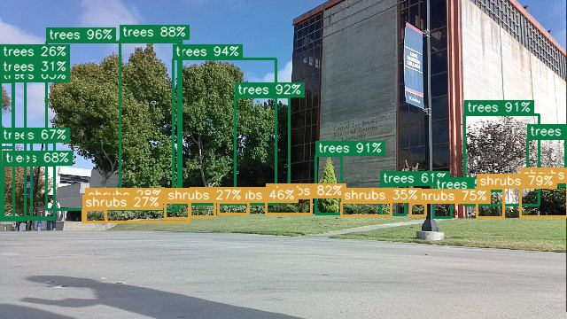
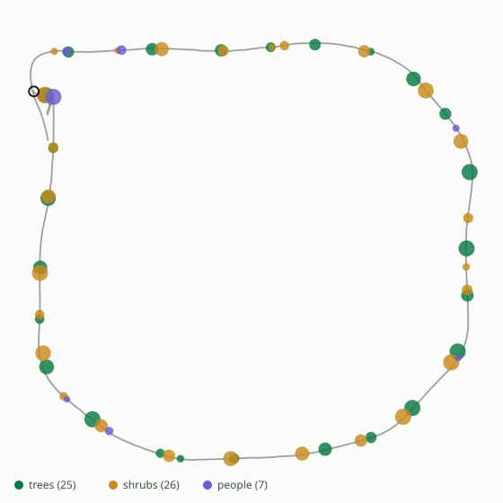
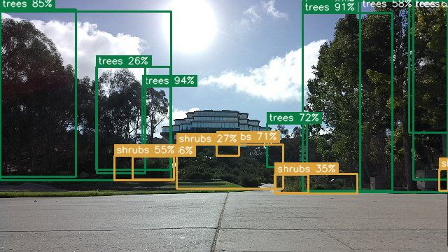
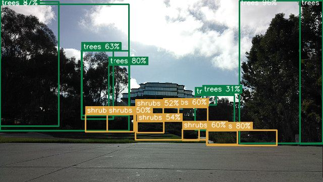

# <div align="center">Grove: An Autonomous GPS Tree Survey Rover</div>
### <div align="center">MAE 148 / ECE 148 Final Project</div>
#### <div align="center">Team 6 — Summer Session II 2026</div>

<div align="center">
  
</div>

## Team Members

<!-- TODO: fill in your teammates' names, majors and contact details before submitting -->
Farbod Haeri — M.S. Mechanical Engineering

*Teammate 2 —*

*Teammate 3 —*

<hr>

## Abstract

Grove is an autonomous rover that surveys vegetation. It drives a saved GPS path
on its own, detects trees, shrubs and people from a camera while it drives, ties
every detection to a centimetre-accurate RTK GPS position, and writes both a
numeric report and an LLM-written summary the moment the lap closes.

The detection runs **on the car**, on a Hailo-8 AI HAT+, not on a laptop and not
in the cloud. We trained our own three-class YOLOv8 model by knowledge
distillation, compiled it to the Hailo's `.hef` format, and measured it on real
hardware at **mAP50 0.735 and 41.8 fps** — roughly 40× the throughput of the
same model on the Raspberry Pi's CPU.

One button in a browser starts the whole thing: the car brings up RTK, arms the
camera, starts detecting, puts itself into full autonomy, drives the loop, stops
itself when it closes, and saves the video and the report.

<hr>

## What We Promised

### Must Have
* Drive a saved GPS path autonomously using RTK positioning
* Detect vegetation from the camera while driving
* Tie every detection to a GPS position and de-duplicate into distinct objects
* Produce a report at the end of the run

### Nice to Have
* Run detection on the AI accelerator instead of the CPU
* A live web dashboard showing what the car sees as it drives
* An LLM writing the survey report, and narrating during the lap
* Start the whole run from the browser with no game controller

<hr>

## Accomplishments

- **Full autonomous survey lap**, started from a browser button: `LAP 1 COMPLETE — 114.7 m driven, back within 5.0 m`
- **Detection on the Hailo-8 AI HAT+.** Our own 3-class model, compiled to `.hef`, verified on hardware at **mAP50 0.735 / 41.8 fps** against the 261-image validation set
- **Knowledge distillation**: an RF-DETR teacher labelled our footage, and we trained a YOLOv8s student on it — no manual labelling of the survey set
- **RTK-fixed positioning** throughout the lap (401 of 441 parsed GGA fixes were RTK-FIXED)
- **Live dashboard** — camera feed with detection boxes, counts, and an LLM narrating every 30 s while the car drives
- **Reports** — numeric, LLM-written, plus an annual carbon estimate
- **Single-file offline report** ([`results/Grove_lap_20260903.html`](results/Grove_lap_20260903.html)) with the whole lap embedded: scrubbable annotated video, route map, and every report. No server, no internet

### Results from the final lap

| | |
|---|---|
| Distance | 114.7 m, lap closed within 5.0 m |
| Frames | 356 recorded, all 356 annotated on the HAT |
| Raw detections | 9,227 |
| **Distinct objects** | **25 trees · 26 shrubs · 7 people** |
| Positioning | RTK-FIXED dominant |
| Carbon (illustrative) | −1,932 kg CO₂/yr |

<div align="center">
  <br>
  <em>The driven loop. Each dot is a merged detection cluster.</em>
</div>

<hr>

## How It Works

```
OAK-D camera ──► record_survey.py ──► frames/*.jpg ─┐
                                                    ├─► live_survey.py ──► Hailo-8 HAT
RTK GPS ──► p1_runner ──► survey_gps_logger.py ─────┘         │            (grove_lb.hef)
                                                              ▼
                                             detections + GPS ──► cluster within 3 m
                                                              ▼
                                        survey report · LLM report · carbon · live narration
                                                              ▼
                                    survey_web.py  (dashboard)   make_offline.py  (shareable HTML)
```

**Why the counts are clusters, not objects.** We have no depth. A detection is
tagged with the position of *the car* when it fired, so we merge detections
within 3 m into one "distinct object". Two trees passed within that radius
become one. Every report says so, and the counts are a **lower bound**.

<hr>

## Hardware

| Part | Notes |
|---|---|
| Raspberry Pi 5 | main compute |
| **Hailo-8 AI HAT+** (26 TOPS) | runs the detection model |
| OAK-D | camera (used as a plain RGB camera here) |
| Quectel LG69T + Point One Polaris | RTK GNSS, centimetre fixes |
| VESC | motor controller |
| Logitech F710 | manual override |

<hr>

## Software

| Directory | What's in it |
|---|---|
| [`survey/`](survey) | everything that runs on the car — orchestration, detection, GPS, dashboard |
| [`model/`](model) | the compiled `grove_lb.hef`, its class list, and the Hailo compile script |
| [`offline_report/`](offline_report) | builds the single-file shareable HTML, plus the accuracy tooling |
| [`results/`](results) | the final lap's reports and its offline HTML report |
| [`docs/`](docs) | reproduction guide and hardware notes |

### The main programs we wrote

| File | Role |
|---|---|
| `survey/survey.sh` | one command runs the whole survey: RTK → drive loop → camera → detection → auto-drive → auto-stop → report |
| `survey/live_survey.py` | detects on frames as they land, clusters by GPS, narrates, writes the report |
| `survey/analyze_survey.py` | clustering, carbon and positioning maths, offline analysis, LLM report |
| `survey/hailo_backend.py` | the Hailo-8 detector, drop-in compatible with the CPU detector |
| `survey/survey_web.py` | the dashboard — live feed, rig control, saved laps |
| `survey/lap_watch.py` | decides when a lap has actually closed, and stops the car |
| `survey/set_drive_mode.py` | puts the car into full autonomy from software |
| `offline_report/make_offline.py` | builds the self-contained HTML report |
| `model/compile_hef.py` | ONNX → Hailo `.hef`, the step that took the longest to get right |

<hr>

## Quickstart

On the car:

```bash
./survey/survey.sh --live --auto        # drives itself, detects, stops, reports
./survey/survey.sh --check              # preflight only, moves nothing
```

From a browser on the same network — `http://<pi-ip>:8090` — press **Start lap**.

Build a shareable report for a finished lap:

```bash
./offline_report/make_lap_report.sh 20260903_165910
```

Full setup, including the RTK credentials this repo deliberately does not
contain, is in the [reproduction guide](docs/reproduction.md).

<hr>

## Challenges

**numpy 2 silently broke the AI HAT.** `pyhailort` is a C extension built
against numpy 1.x. Under the numpy-2 environment our detector ran in, every
inference failed with `Memory size of vstream ... does not match the frame count
(got 0)` — the extension cannot read a numpy-2 array at all, and no array form
works around it. Our self-test passed the whole time because it ran under a
*different* interpreter. Fixed by selecting the interpreter based on whether the
HAT is present.

**Letterboxing was worth 28% accuracy.** Plain-resizing frames to 640×640
distorts aspect ratio. Measured on the validation set: mAP50 **0.618** plain
resize vs **0.795** letterboxed. We recompiled the model with letterboxed
calibration and matched the car's preprocessing to it.

**YOLOv8's detection head will not compile for the Hailo.** `/model.22/dfl/Reshape`,
`/Sub` and `/Add_1` are all unsupported. The fix is to cut the graph before the
head at the six detection convolutions and let the chip's own NMS decode the
boxes.

**Two RTK runners fought over one serial port.** The watchdog restarted a wedged
correction runner without confirming the old one had died, so both held the
control port, every reset timed out, and the fix never left 2–5 m accuracy for a
whole session. Two runners is strictly worse than none — it cannot self-recover.

**`POST /drive` does not set the drive mode.** It returns `200` and does nothing:
only the websocket handler latches the mode, and the joystick overwrites an
unlatched one within ~50 ms. That is why the car sat still the first time we
tried to start it from software.

<hr>

## Final Project Media

### Interactive lap report
Download [`results/Grove_lap_20260903.html`](results/Grove_lap_20260903.html) and
open it — the full annotated video, route map and every report, in one file that
works with the internet off.

<div align="center">
  
  
</div>

<!-- TODO: add links to the presentation slides and demo video once uploaded -->
### Final Presentation Slides
*link to be added*

### Demo Video
*link to be added*

<hr>

## Documentation

- [Reproduction guide](docs/reproduction.md) — set the car up and run a survey from scratch
- [Hardware notes](docs/hardware.md) — wiring, ports, and the traps that cost us time

<hr>

## Acknowledgements

Thank you to Professor Jack Silberman and TAs Jose Castillo-Valdovinos and
Daniel Galicia Ortiz for the course.

README format referenced from
[UCSD-ECE180-SUMMER_I-Final_Project-Team_5](https://github.com/UCSD-Silberman-Classes-and-Projects/UCSD-ECE180-SUMMER_I-Final_Project-Team_5).

<hr>

## Contacts

* Farbod Haeri — farbodh97@gmail.com | [GitHub](https://github.com/Farbod97)
